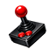

# RedOwl.Input

A robust input system for Raylib games built on .NET. Provides both state access and event-driven input handling with powerful action mapping capabilities.

<p align="center">

</p>

## Features

- ⚡ **High Performance** - Efficient single-poll-per-frame architecture
- 🎯 **Action Mapping** - Bind multiple input sources to a single action (e.g., WASD + Arrow Keys + Gamepad)
- 📡 **Event-Driven** - Subscribe to input events for reactive programming
- 🎛️ **State-Based** - Query input state directly for fast prototyping
- 🎨 **Composable** - Build complex input schemes with simple bindings
- 🚀 **Simple** - Designed to have a simple and straight forward API implementation

## Installation

```sh
dotnet add package RedOwl.Input
```

## Quick Start

You only need to call `Input.Update()` once per frame as this will poll for the entire input state this frame and store it
so that input state queries are fast.  This will also trigger any input events to be fired at this time if the input
control has changed its value.

```csharp
using RedOwl;
using Raylib_cs;

// Use Reactive Pattern - Will be triggered when Input.Update is called
// Will only trigger if key was pressed or released this frame
Input.OnKeyboard += (e) => 
{
    if (e.Key == KeyboardKey.Space && e.Pressed)
        Jump();
};

// Or use action mappings - library has several predefined action mappings
var move = Input.StandardMoveControl();

// Or define your own mappings
var move = new TwoAxisControl()
    .Bind(Input.Gamepad.LeftStick)
    .Bind(
        Input.Keyboard.KeyA, Input.Keyboard.KeyD,    // A/D for X axis
        Input.Keyboard.KeyW, Input.Keyboard.KeyS     // W/S for Y axis
    )
    .Bind(
        Input.Keyboard.KeyLeftArrow, Input.Keyboard.KeyRightArrow,  // Arrows X
        Input.Keyboard.KeyUpArrow,   Input.Keyboard.KeyDownArrow    // Arrows Y
    )
    .Enable();

while (!Raylib.WindowShouldClose())
{
    var dt = Raylib.GetFrameTime();
    
    // Poll and store input state for this frame and emit change events
    // This also processes all registered controls and their interactions
    Input.Update(dt);
    
    // Query input state directly
    if (Input.Keyboard.KeyW.Pressed)
    {
        MoveForward();
    }

    // Query input state using bound controls
    MoveCharacter(move.Value);
    
    // ... rest of game loop
}
```

## Core Concepts

### State vs Events

RedOwl.Input provides two complementary ways to handle input:

1. **State Query** - Check input state stored this frame directly
2. **Event Handlers** - React to input changes this frame

Both can be used together if needed.

### Action Mapping

The library's powerful action mapping system lets you combine multiple input sources into unified actions. For example, a "Move" action can combine:
- WASD keyboard keys
- Arrow keys
- Gamepad left stick

All inputs are automatically normalized and combined.

### Accessing Input State

Use the convenient shortcuts:

```csharp
Input.Keyboard  // Access keyboard state
Input.Mouse     // Access mouse state
Input.Gamepad   // Access gamepad state
```

### State Properties

Most keys are a `ButtonState` with these properties:

```csharp
bool Pressed              // Key is currently down
bool Released             // Key is currently up
bool WasPressedThisFrame  // Key was pressed this frame (edge trigger)
bool WasReleasedThisFrame // Key was released this frame (edge trigger)
bool ChangedThisFrame     // Key state changed this frame
float Value               // 1.0 if pressed, 0.0 if not pressed
```

Some keys are a `TwoAxisState` with these properties:

```csharp
OneAxisState X 
OneAxisState Y 
bool ChangedThisFrame     // X or Y state changed this frame
Vector2 Value             // 0.0 -> 1.0 per axis
```

`TwoAxisState` are made up of `OneAxisState` with these properties

```csharp
bool ChangedThisFrame     // state changed this frame
float Value               // 0.0 - 1.0
```

## Keyboard Input

```csharp
// Check if a key is currently pressed
if (Input.Keyboard.KeyW.Pressed)
{
    // Moving forward
}

// Check if key was pressed this frame
if (Input.Keyboard.KeySpace.WasPressedThisFrame)
{
    // Jump!
}

// Check if key was released this frame
if (Input.Keyboard.KeyEscape.WasReleasedThisFrame)
{
    // Pause game
}

// Check modifier keys directly
if (Input.Keyboard.Control && Input.Keyboard.KeyS.Pressed)
{
    SaveGame();
}
```

## Mouse Input

```csharp
// Current mouse position
var pos = Input.Mouse.Position.Value;  // Vector2

// Mouse movement delta (this frame)
var delta = Input.Mouse.PositionDelta.Value;  // Vector2

// Clamped delta (between -1 and 1)
var clamped = Input.Mouse.PositionDeltaClamped.Value;

// Check button state
if (Input.Mouse.LeftButton.Pressed)
{
    // Left mouse button held
}

if (Input.Mouse.RightButton.WasPressedThisFrame)
{
    // Right mouse button clicked
}

// Scroll delta
var scroll = Input.Mouse.ScrollDelta.Value;  // Vector2 (X and Y scrolling)

// Clamped scroll (between -1 and 1)
var clamped = Input.Mouse.ScrollDeltaClamped.Value;

// Move mouse cursor to screen position
Input.Mouse.MoveTo(x, y);  
```

## Gamepad Input

Deadzone is automatically applied (default 0.15). Adjust via `Input.AxisDeadzone`.

```csharp
// Left stick (normalized to -1 to 1, with deadzone applied)
var leftStick = Input.Gamepad.LeftStick.Value;  // Vector2

// Right stick
var rightStick = Input.Gamepad.RightStick.Value;

// Face buttons (PlayStation: Triangle/Circle/Cross/Square, Xbox: Y/B/A/X)
if (Input.Gamepad.ButtonNorth.Pressed) { }  // Top face button
if (Input.Gamepad.ButtonSouth.Pressed) { }  // Bottom face button
if (Input.Gamepad.ButtonEast.Pressed)  { }  // Right face button
if (Input.Gamepad.ButtonWest.Pressed)  { }  // Left face button

// Shoulders and triggers
if (Input.Gamepad.LeftShoulder.Pressed)  { }
if (Input.Gamepad.RightShoulder.Pressed) { }
if (Input.Gamepad.LeftTrigger.Pressed)   { }
if (Input.Gamepad.RightTrigger.Pressed)  { }

// D-Pad
if (Input.Gamepad.DPadUp.Pressed)    { }
if (Input.Gamepad.DPadDown.Pressed)  { }
if (Input.Gamepad.DPadLeft.Pressed)  { }
if (Input.Gamepad.DPadRight.Pressed) { }

// Special buttons
if (Input.Gamepad.Select.Pressed) { }  // Back/Select button
if (Input.Gamepad.Start.Pressed)  { }  // Start/Menu button

// Stick press buttons
if (Input.Gamepad.LeftStickPress.Pressed)  { }
if (Input.Gamepad.RightStickPress.Pressed) { }

// Rumble: left motor, right motor, duration (seconds)
Input.Gamepad.Rumble(0.5f, 0.5f, 0.3f);
```

## Event System

Subscribe to input events for reactive programming:

```csharp
// Keyboard events
Input.OnKeyboard += (e) =>
{
    Console.WriteLine($"Key: {e.Key}, Down: {e.Pressed}, Modifiers: {e.Modifiers}");
};

// Mouse events
Input.OnMouse += (e) =>
{
    Console.WriteLine($"Mouse moved to {e.Position}, delta: {e.Delta}");
};

Input.OnMouseButton += (e) =>
{
    Console.WriteLine($"Mouse button {e.Button} {(e.Pressed ? "pressed" : "released")}");
};

Input.OnMouseWheel += (e) =>
{
    Console.WriteLine($"Wheel scrolled: {e.Delta}");
};

// Gamepad events
Input.OnGamepadButton += (e) =>
{
    Console.WriteLine($"Gamepad button {e.Button} {(e.Pressed ? "pressed" : "released")}");
};

Input.OnGamepadAxis += (e) =>
{
    Console.WriteLine($"Gamepad axis: {e.Value}");
};

// Text input (character typing)
Input.OnTextInput += (e) =>
{
    Console.WriteLine($"Character typed: {e.Character}");
};

// Catch-all event handler
Input.OnAny += (e) =>
{
    switch (e.Type)
    {
        case Input.Event.Types.Keyboard:
            // Handle keyboard event
            break;
        // ... other types
    }
};
```

### Event Types

- `GamepadAxisEvent` - Gamepad stick movement
- `GamepadButtonEvent` - Gamepad button press/release
- `MouseEvent` - Mouse movement
- `MouseWheelEvent` - Scroll wheel movement
- `MouseButtonEvent` - Mouse button press/release
- `KeyboardEvent` - Keyboard key press/release
- `TextInputEvent` - Character input (for text entry)

## Action Mapping

The action mapping system lets you combine multiple input sources into unified actions.

### ButtonControl

Combine multiple buttons into a single action. By default, **any** binding being active will trigger the control:

```csharp
var jumpAction = new ButtonControl()
    .Bind(Input.Keyboard.KeySpace)      // Space key
    .Bind(Input.Gamepad.ButtonSouth)    // A/X button
    .Enable();

// Check the action
if (jumpAction.Pressed)
{
    Jump();  // Triggers if Space OR Gamepad A/X is pressed
}

if (jumpAction.WasPressedThisFrame)
{
    StartJumpAnimation();
}
```

#### Combination Inputs

For actions that require **all** bindings to be active simultaneously (like keyboard shortcuts or gamepad combos), use `.RequireAll()`:

```csharp
// Keyboard shortcut: Ctrl + C
var copyAction = new ButtonControl()
    .Bind(Input.Keyboard.Control)       // Ctrl modifier
    .Bind(Input.Keyboard.KeyC)          // C key
    .RequireAll()                        // Both must be pressed together
    .Enable();

if (copyAction.WasPressedThisFrame)
{
    CopyToClipboard();  // Only triggers when Ctrl+C is pressed together
}

// Gamepad combo: Left Shoulder + D-Pad Up
var specialMove = new ButtonControl()
    .Bind(Input.Gamepad.LeftShoulder)
    .Bind(Input.Gamepad.DPadUp)
    .RequireAll()
    .Enable();

if (specialMove.Pressed)
{
    PerformSpecialMove();  // Only active when both buttons are held
}
```

### OneAxisControl

Combine single-axis inputs:

```csharp
var zoomAction = new OneAxisControl()
    .Bind(Input.Mouse.ScrollDeltaClamped.Y)  // Mouse scroll wheel
    .Enable();

var zoomAmount = zoomAction.Value;  // -1 to 1
ZoomCamera(zoomAmount);
```

Can also bind the axis to a button control

```csharp
var HotbarIncrement = new ButtonControl()
    .Bind(Input.Mouse.ScrollDeltaClamped.Y.Neg) // Negative values Trigger ButtonControl
    .Bind(Input.Gamepad.DPadRight)
    .Enable();
var HotbarDecrement = new ButtonControl()
    .Bind(Input.Mouse.ScrollDeltaClamped.Y.Pos) // Positive values Trigger ButtonControl
    .Bind(Input.Gamepad.DPadLeft)
    .Enable();
```

### TwoAxisControl

Combine multiple 2D inputs (keyboard + gamepad + mouse):

```csharp
var moveAction = new TwoAxisControl()
    .Bind(Input.Gamepad.LeftStick)                    // Gamepad left stick
    .Bind(
        Input.Keyboard.KeyA, Input.Keyboard.KeyD,    // A/D for X axis
        Input.Keyboard.KeyW, Input.Keyboard.KeyS     // W/S for Y axis
    )
    .Bind(
        Input.Keyboard.KeyLeftArrow, Input.Keyboard.KeyRightArrow,  // Arrows X
        Input.Keyboard.KeyUpArrow,   Input.Keyboard.KeyDownArrow    // Arrows Y
    )
    .Enable();

// Get combined input value
var moveDirection = moveAction.Value;  // Vector2, normalized to -1 to 1
MoveCharacter(moveDirection);
```

### ButtonAxis

Create an axis from two buttons:

```csharp
var horizontalAxis = new ButtonAxis(
    Input.Keyboard.KeyD,  // Positive
    Input.Keyboard.KeyA   // Negative
);

var value = horizontalAxis.Value;  // 1.0 if D pressed, -1.0 if A pressed, 0.0 if neither/both
```

### Button Interactions

`ButtonControl` supports composable interactions that process button state each frame. Interactions are automatically processed during `Input.Update()`, so you can query their results as simple properties without passing delta time.

#### Double Tap Interaction

Detects double-tap gestures:

```csharp
var useAction = new ButtonControl()
    .Bind(Input.Keyboard.KeySpace)
    .Bind(Input.Gamepad.ButtonSouth)
    .With(new DoubleTapInteraction { Threshold = 0.3f })  // 0.3 second window for double-tap
    .Enable();

// Query double-tap state (no delta time needed!)
if (useAction.WasDoubleTappedThisFrame)
{
    PerformSpecialAction();  // Double-tap detected
}

if (useAction.WasPressedThisFrame)
{
    PerformNormalAction();  // Single tap
}
```

**Configuration:**
- `Threshold` (default: 0.3f) - Maximum time in seconds between two taps to be considered a double-tap

#### Hold Interaction

Handles hold behavior for button presses. Supports two modes that can be used independently or together:

1. **Repeat Mode** - Triggers repeatedly while held (like rapid-fire weapons)
2. **Long Press Mode** - Detects when held for a specified duration (like delete confirmation or power button)

**Repeat Mode Example:**

```csharp
var scrollAction = new ButtonControl()
    .Bind(Input.Keyboard.KeyUpArrow)
    .With(new HoldInteraction 
    { 
        RepeatMode = true,           // Enable repeat mode
        InitialRepeatDelay = 0.3f,   // Wait 0.3s before first repeat
        RepeatInterval = 0.15f,       // Then repeat every 0.15s
        FireOnPress = true            // Fire immediately on press, then repeat
    })
    .Enable();

// Query repeat state
var repeatCount = scrollAction.HoldCountThisFrame;  // 0, 1, or >1 if frame time is large
for (int i = 0; i < repeatCount; i++)
{
    ScrollInventory();  // Process each repeat
}
```

**Long Press Mode Example:**

```csharp
var deleteAction = new ButtonControl()
    .Bind(Input.Keyboard.KeyDelete)
    .With(new HoldInteraction 
    { 
        LongPressMode = true,         // Enable long press mode
        LongPressThreshold = 3.0f     // Must hold for 3 seconds
    })
    .Enable();

// Query long press state
if (deleteAction.WasHeldThisFrame)
{
    // Threshold just crossed - show confirmation UI
    ShowDeleteConfirmation();
}

if (deleteAction.IsHeld)
{
    // Still held past threshold - perform the action continuously
    PerformDelete();
}

// Query progress for UI (0.0 to 1.0)
if (deleteAction.Pressed)
{
    var progress = deleteAction.HoldProgress;  // Only meaningful when button is held
    UpdateProgressBar(progress);  // Drive a fill bar UI element
}
else
{
    HideProgressBar();  // Hide when not being held
}
```

**Both Modes Example:**

```csharp
var action = new ButtonControl()
    .Bind(Input.Keyboard.KeySpace)
    .With(new HoldInteraction 
    { 
        RepeatMode = true,            // Enable repeat
        InitialRepeatDelay = 0.5f,
        RepeatInterval = 0.1f,
        LongPressMode = true,          // Also enable long press
        LongPressThreshold = 2.0f      // Hold for 2 seconds
    })
    .Enable();

// Use repeat mode
var repeatCount = action.HoldCountThisFrame;
for (int i = 0; i < repeatCount; i++)
{
    PerformAction();
}

// Use long press mode
if (action.WasHeldThisFrame)
{
    PerformSpecialAction();  // Triggered once after 2 seconds
}

// Show progress bar
if (action.Pressed)
{
    UpdateProgressBar(action.HoldProgress);
}
```

**Configuration:**

**Repeat Mode:**
- `RepeatMode` (default: true) - Enable repeat mode
- `InitialRepeatDelay` (default: 0.3f) - Delay in seconds before repeat starts
- `RepeatInterval` (default: 0.15f) - Interval in seconds between repeat triggers after initial delay
- `FireOnPress` (default: true) - If true, triggers once immediately on press, then repeats after delay. If false, only triggers after initial delay, then repeats.

**Long Press Mode:**
- `LongPressMode` (default: false) - Enable long press mode
- `LongPressThreshold` (default: 3.0f) - Duration in seconds the button must be held before triggering

**Properties:**

**Repeat Mode:**
- `HoldCountThisFrame` - Returns the number of times to trigger this frame (0, 1, or >1 if frame time is large). Only meaningful when `RepeatMode` is true.

**Long Press Mode:**
- `IsHeld` - Returns `true` if the button has been held past the threshold and is still being held. Only meaningful when `LongPressMode` is true.
- `WasHeldThisFrame` - Returns `true` if the threshold was crossed this frame (edge detection). Only meaningful when `LongPressMode` is true.
- `HoldProgress` (on `ButtonControl`) - Returns the progress as a normalized value between 0.0 and 1.0. Returns 0.0 when not held or just pressed, increases while held, and reaches 1.0 when threshold is reached. Perfect for driving UI progress bars. Only meaningful when `LongPressMode` is true and the button is currently pressed.

**Notes:**
- `HoldCountThisFrame` can be greater than 1 if the frame time is large (e.g., during lag spikes). This ensures consistent behavior regardless of frame rate.
- Long press resets immediately when the button is released, so you must hold continuously for the full duration.

#### Combining Interactions

You can add multiple interactions to a single control:

```csharp
var action = new ButtonControl()
    .Bind(Input.Keyboard.KeySpace)
    .With(new DoubleTapInteraction { Threshold = 0.3f })
    .With(new HoldInteraction 
    { 
        RepeatMode = true,
        InitialRepeatDelay = 0.5f,
        RepeatInterval = 0.1f,
        FireOnPress = false,  // Don't fire on initial press, wait for hold
        LongPressMode = true,
        LongPressThreshold = 2.0f
    })
    .Enable();

// Query all interaction states
if (action.WasDoubleTappedThisFrame)
{
    // Handle double-tap
}
else if (action.WasHeldThisFrame)
{
    // Handle long press threshold crossed
}
else if (action.HoldCountThisFrame > 0)
{
    // Handle hold/repeat
}
else if (action.WasPressedThisFrame)
{
    // Handle single tap
}
```

#### Querying Unconfigured Interactions

If you query an interaction property that wasn't configured for the control, it returns a safe default value:
- `WasDoubleTappedThisFrame` returns `false` if `DoubleTapInteraction` is not configured
- `HoldCountThisFrame` returns `0` if `HoldInteraction` is not configured

This allows you to query interaction properties without checking if they're configured first.

#### Control Lifecycle

Controls automatically register themselves when created and are processed each frame during `Input.Update()`. If you no longer need a control, you can dispose it to stop processing:

```csharp
var action = new ButtonControl()
    .Bind(Input.Keyboard.KeySpace)
    .Enable();

// ... use the control ...

// When done, dispose it to stop processing
action.Dispose();
```

Controls will also be automatically cleaned up when garbage collected (via finalizer), but it's recommended to explicitly dispose long-lived controls when they're no longer needed.

## Standard Action Mappings

The library includes helper methods for common input schemes:

```csharp
var input = Input.State;

// Standard movement (WASD + Arrows + Gamepad Left Stick)
var move = input.StandardMoveControl();

// Standard look (Mouse Delta + Gamepad Right Stick)
var look = input.StandardLookControl();

// Standard zoom (Mouse Scroll Wheel)
var zoom = input.StandardZoomControl();

// Standard back/cancel (Escape + Gamepad B/Circle)
var back = input.StandardBackControl();

// Standard use/interact (Space + Gamepad A/Cross) - configured with double-tap interaction
var use = input.StandardUseControl();

// Standard action (Left Click + F + Gamepad X/Square)
var action = input.StandardActionControl();

// Standard special (Right Click + R + Gamepad Y/Triangle)
var special = input.StandardSpecialControl();
```

## Settings

Configure global input settings:

```csharp
// Gamepad stick deadzone (default: 0.15)
Input.AxisDeadzone = 0.2f;

// Threshold for axis change detection (default: 0.0001)
Input.AxisChangeThreshold = 0.001f;
```

## Disabling Input

Disable the entire input system:

```csharp
Input.State.Enabled = false;  // Prevents all input polling
Input.Keyboard.Enabled = false; // Just Disable Keyboard
Input.Mouse.Enabled = false; // Just Disable Mouse
Input.Gamepad.Enabled = false; // Just Disable Gamepad
```

### Custom Action Mapping

```csharp
var attack = new ButtonControl()
    .Bind(Input.Mouse.LeftButton)
    .Bind(Input.Keyboard.KeyF)
    .Bind(Input.Gamepad.ButtonEast)
    .Enable();

var block = new ButtonControl()
    .Bind(Input.Mouse.RightButton)
    .Bind(Input.Gamepad.LeftShoulder)
    .Enable();

while (running)
{
    Input.Update();
    
    if (attack.Pressed && !block.Pressed)
    {
        Attack();
    }
    else if (block.Pressed)
    {
        Block();
    }
}
```

## License

See [LICENSE](LICENSE) file for details.

## Credits

Built on top of [Raylib-cs](https://github.com/ChrisDill/Raylib-cs) using [Raylib](https://www.raylib.com/).

---

Made with ❤️ by Red Owl Games
